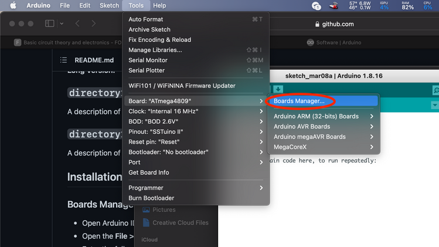
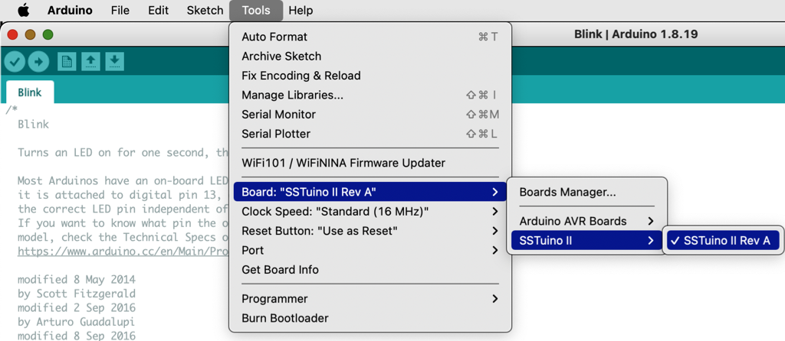
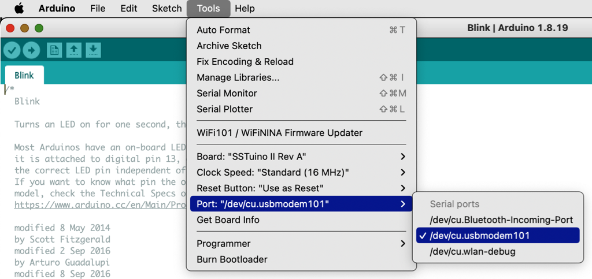
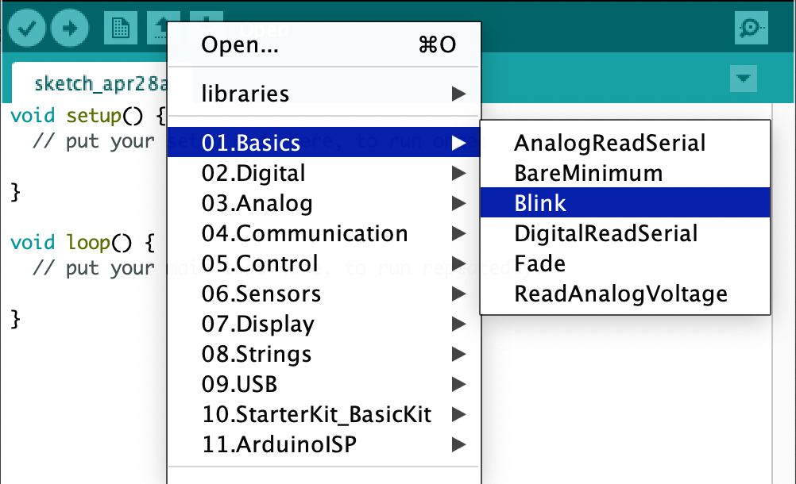
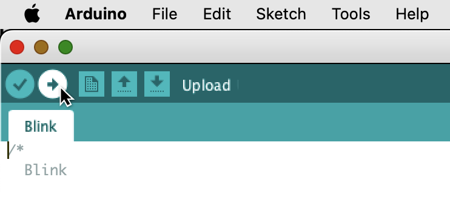

# Setup



## Software

### Arduino IDE

```shell
brew install arduino
```

### Installing the SSTuino II board type

#### 1. Go to preferences of the Arduino app

<div align="center"></div>

#### 2. Copy this line and paste it into the box circled ("Additional Boards Manager URLs"):

```html
https://fourierindustries-llp.github.io/SSTuino_II_Core/package_FourierIndustries-LLP_SSTuino_II_Core_index.json 
```

#### 3. Enable the Show verbose output during upload. Click 🆗.

.png>)

#### 4. Go to Tools > Board > Boards Manager



#### 5. Type in <mark style="color:orange;">`SSTuino`</mark> into the search bar and click on install

.png>)

#### 6. Connect SSTuino to the Computer. Enjoy your First Experience with SSTuino!



#### 7. Select board as "SSTuino II Rev A"



#### 8. Select port as cu.usbmodem



#### 9. Open Blink from the Built-in examples



#### 10. Upload blink to SSTuino



#### Hello World



#### \* If you wish to restore to the First Experience Code, download and flash this!

[OOTB.ino](https://drive.google.com/uc?export=download\&id=1t6W0f2w4zVcAI5OoJOURnChV2kE_yLXY)

## Hardware

.png>)

| No. | Component Name                       | Quantity |
| --- | ------------------------------------ | -------- |
| 1   | SSTuino II                           | 1        |
| 2   | Explorer Board                       | 1        |
| 3   | USB-C Cable                          | 1        |
| 4   | Breadboard                           | 1        |
| 5   | Dupont cables (wires) (M-M), (M-F)   | 1 Each   |
| 6   | Assortment of LEDs                   | 1 Bag    |
| 7   | Buzzer                               | 1        |
| 8   | Push Button                          | 2        |
| 9   | Potentiometer (10kΩ)                 | 1        |
| 10  | Light Dependant Resistor             | 1        |
| 11  | Temperature Sensor (TMP36)           | 1        |
| 12  | Ultrasonic Distance Sensor           | 1        |
| 13  | Passive Infrared (PIR) Motion Sensor | 1        |
| 14  | Servo                                | 1        |
| 15  | RGB LED (Common cathode)             | 1        |
| 16  | 330Ω and 10kΩ resistor reel          | 1 Bag    |

