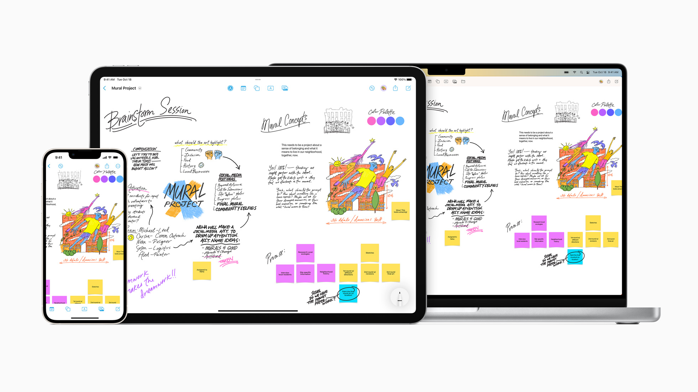

# Freeform

<figure><figcaption></figcaption></figure>

**Freeform**, available starting with macOS 13.1, provides a flexible, infinite canvas for visually organizing content—similar to Padlet. Users can add and arrange a wide variety of files, including images, documents, and links, and preview them inline without ever leaving the board.

A standout feature of Freeform is **Scenes**—saved views that allow you to structure your board into organized sections. Scenes make it easy to label, reorder, and present content step-by-step, much like Prezi, making your board ideal for storytelling or guided walkthroughs.

Designed for collaboration, Freeform lets you easily invite others to contribute in real time. Boards are stored in iCloud, keeping everything in sync across your Apple devices.

**Examples**\
[SST Inc. Job Board](https://www.icloud.com/freeform/015ROVKEekGVqCOBZTWWEaymg#SST_Inc._Job_Board)\
[DUCKS Storyboard](https://www.icloud.com/freeform/0aeOtO2vmVjlryWigE35FgrRQ#DUCKS_Storyboard)\
[Human Powered Vehicle Mindmap](https://www.icloud.com/freeform/05d1-h2RsFKxC8kiYP0QRmMCg#Human_Powered_Vehicle)
